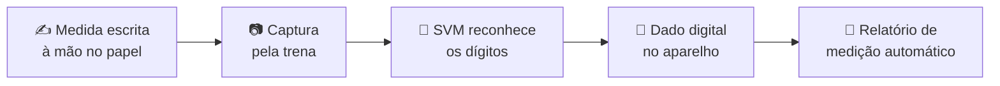

<div align="center">

<a href="https://gotardon1.github.io/GotardoN1/#projeto/trena">
  <picture>
    <source media="(prefers-color-scheme: dark)" srcset="https://raw.githubusercontent.com/GotardoN1/GotardoN1/main/assets/projetos/trena-dark.svg">
    
  </picture>
</a>


**[Ver no portfólio interativo](https://gotardon1.github.io/GotardoN1/#projeto/trena)** · **[Perfil](https://github.com/GotardoN1)**

</div>

## Sobre

Profissionais de engenharia e arquitetura anotam medidas à mão e depois perdem tempo passando tudo para o relatório. Este projeto propõe uma **trena eletrônica** que resolve isso com **Machine Learning**: um modelo **SVM (Support Vector Machine)** reconhece as medidas escritas à mão no papel e as transforma em dados digitais dentro do próprio aparelho.

## Como funciona



## Destaques

| | |
|---|---|
| **Reconhecimento de dígitos** | Medidas manuscritas viram dados digitais |
| **Relatórios automáticos** | O relatório de medição é gerado pelo próprio equipamento |
| **Interface otimizada** | No estudo, o tempo de medição caiu **24%** em relação à trena convencional |
| **Acurácia** | No estudo, o modelo chegou a **93,49%** nos dados de treinamento |

## Tecnologias e métodos

| Área | Ferramenta |
|---|---|
| Linguagem | Python |
| Machine Learning | SVM com scikit-learn |
| Dados do estudo | MNIST (60.000 exemplos de dígitos manuscritos) |
| UX/UI | Protótipo da interface no Figma |
| Metodologia de design | Framework PACT (Pessoas, Atividades, Contexto e Tecnologias) e ML-Process Canvas |

## Neste repositório

| Arquivo | Conteúdo |
|---|---|
| [`main.py`](main.py) | Demonstração do classificador SVM. Treina e avalia com o conjunto de dígitos que já vem no scikit-learn |
| [`requirements.txt`](requirements.txt) | Dependências: scikit-learn, matplotlib e NumPy |
| [`PI6Periodo.pdf`](PI6Periodo.pdf) | Artigo completo, com a metodologia e os resultados |

## Como executar

```bash
pip install -r requirements.txt
python main.py
```

O script mostra o relatório de classificação (precisão, revocação e F1 por dígito). O `main.py` usa o conjunto de dígitos 8×8 do scikit-learn, mais leve, então o resultado pode ser diferente dos 93,49% do artigo, que usou o MNIST.

## Autores

| | |
|---|---|
| **Fabrício Corrêa de Souza** | Autor |
| **Matheus Gonçalves Gotardo** | Autor |
| **Prof. MSc. Ricardo Massao Kagami** | Orientador |

---

<div align="center">
<sub>Mais projetos: <a href="https://github.com/GotardoN1/medicao-obras-ocr">Medição de obras com OCR</a> · <a href="https://github.com/GotardoN1/bi-eficiencia-energetica">BI e eficiência energética</a> · <a href="https://gotardon1.github.io/GotardoN1/#projetos">todos no portfólio</a></sub>
</div>
